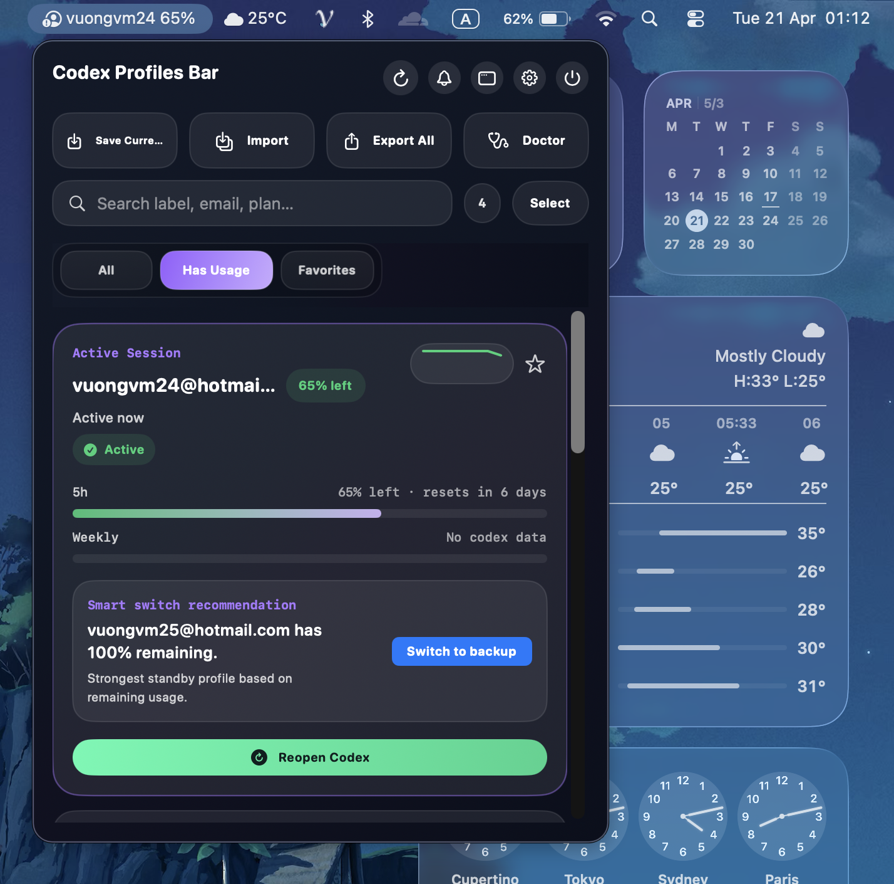

# Codex Profiles Bar

<p align="center">
  Native macOS menu bar app for managing multiple Codex sessions directly from your status bar.
</p>

<p align="center">
  Save the current session, switch accounts, inspect usage, run health checks, filter accounts, and package everything as a clean macOS app.
</p>

<p align="center">
  
</p>

<p align="center">
  
</p>

## Overview

Codex Profiles Bar is a standalone macOS app that works directly with the same `~/.codex` storage used by Codex.

It keeps profile management in the menu bar so you can:

- see all saved profiles and the current active session at a glance
- switch between sessions without dropping back to the terminal
- inspect remaining usage, low-usage trends, and aggregate usage from the status bar UI
- search, filter, favorite, and review saved profiles in a detached panel window
- save the current session, rename labels, clear labels, delete profiles, and repair local storage
- import and export portable JSON bundles
- receive low-usage alerts and optionally auto-switch before a profile is exhausted

No separate profile-management CLI is required.

## Highlights

| Feature | What it does |
| --- | --- |
| Menu bar workflow | Fast access from the macOS status bar |
| Built-in profile engine | Reads and writes profile data directly in `~/.codex` |
| Active session detection | Keeps the current session pinned and easy to identify |
| Usage inspection | Shows remaining usage, sparkline history, aggregate stats, and refreshes automatically |
| Search and filters | Filter profiles by usage or favorites and search by label, email, or plan |
| Session management | Save, switch, label, clear, delete, import, and export |
| Alerts and auto-switch | Notify on low usage or reset windows and auto-switch to the best fallback profile |
| Detached panel and themes | Open a larger panel window with system, light, or dark appearance |
| Doctor tools | Run storage checks and apply safe repairs |
| Launch at login | Start automatically after login for packaged installs |
| Packaging helpers | Build a standalone `.app` bundle and `.dmg` installer |

## Requirements

- macOS 14 or newer
- Swift 6 / Xcode 16 toolchain
- Codex CLI installed and signed in at least once
- Local Codex auth available in `~/.codex/auth.json`

## Setup

Before using the app, make sure Codex itself is ready:

```bash
codex login
```

Codex Profiles Bar reads and writes the same local storage used by Codex, so it expects:

- `~/.codex/auth.json` to exist

## Run Locally

```bash
git clone https://github.com/MinhVuong1997/codex-profiles-bar.git CodexProfilesBar
cd CodexProfilesBar
swift run
```

You can also open `Package.swift` in Xcode and run the app there.

## How It Works

The app manages profiles directly in your local Codex home:

- current auth: `~/.codex/auth.json`
- saved profiles: `~/.codex/profiles/*.json`
- profile metadata index: `~/.codex/profiles/profiles.json`

It uses the same storage layout as Codex itself, so switching and saving profiles stays local to your machine.

## Package For Installation

Build the `.app` bundle:

```bash
./scripts/build-app.sh
```

Build the `.dmg` installer:

```bash
./scripts/build-dmg.sh
```

Build artifacts are written to:

```text
dist/
```

After copying `CodexProfilesBar.app` into `/Applications`, you can enable launch at login from Settings.

## Project Structure

```text
Sources/CodexProfilesBar   SwiftUI app source
Assets/                    App icon and README assets
scripts/                   Build and packaging helpers
dist/                      Generated .app and .dmg output
```

## Development Notes

- The app is built with SwiftUI and shipped as a Swift Package executable.
- The built-in engine handles profile storage, session switching, import/export, usage fetching, and doctor checks inside the app.
- App icons are generated from `scripts/generate-icon.py`.
- Packaging output is created in `dist/`.

## License

MIT. See [LICENSE](LICENSE).
