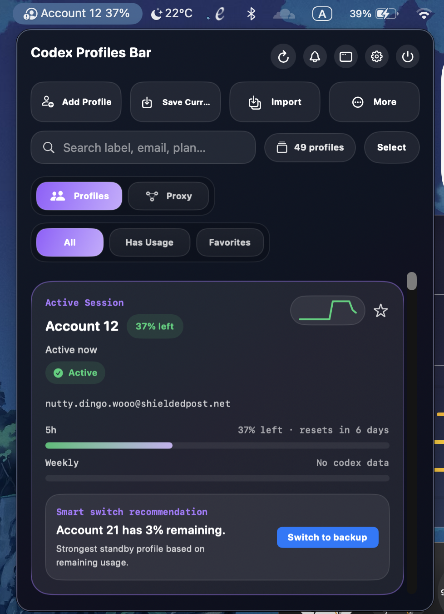

# Codex Profiles Bar

<p align="center">
  
</p>

<p align="center">
  A native macOS menu bar app for saving, switching, inspecting, importing, and routing multiple Codex profiles.
</p>

<p align="center">
  
</p>

## Overview

Codex Profiles Bar works directly with the local `~/.codex` storage used by Codex. It keeps common profile workflows in the macOS status bar: save the current session, switch accounts, inspect usage, manage saved profiles, review alerts, and optionally route Codex through a local proxy so account switching does not require restarting Codex after the proxy is configured.

The app is a standalone SwiftUI executable package with no external Swift package dependencies.

## Features

| Area | Details |
| --- | --- |
| Profile management | Save the active Codex session, switch profiles, rename labels, clear labels, delete profiles, and repair local storage. |
| Usage visibility | Inspect remaining usage, usage history, aggregate stats, warning states, and refresh status from the app UI. |
| Search and organization | Search profiles, filter by usage or favorites, reorder saved profiles, and open a detached panel view. |
| Import and export | Preview imported bundles before writing to `~/.codex`, then import or export portable JSON profile bundles. |
| Alerts | Enable low-usage notifications, review the notification inbox, and optionally auto-switch when a profile is close to depletion. |
| Model proxy | Run an optional loopback proxy that follows the active profile and exposes an OpenAI-compatible `/v1` endpoint. |
| Settings | Configure theme, compact mode, usage refresh behavior, notifications, accent color, proxy settings, and launch at login. |
| Packaging | Build a signed local `.app` bundle and `.dmg` installer from scripts in this repo. |

## Requirements

- macOS 14 or newer
- Swift 6.2 toolchain, or Xcode with Swift 6.2 support
- Codex CLI installed and available as `codex`
- Python 3 with Pillow installed when regenerating icons or running packaging scripts

## Quick Start

Clone and run the app:

```bash
git clone https://github.com/MinhVuong1997/codex-profiles-bar.git CodexProfilesBar
cd CodexProfilesBar
swift run
```

You can also open `Package.swift` in Xcode and run the `CodexProfilesBar` executable target.

## Profile Storage

The app reads and writes the same local Codex home used by the CLI:

```text
~/.codex/auth.json
~/.codex/profiles/*.json
~/.codex/profiles/profiles.json
```

Use **Add Profile** in the app to sign in with Codex and save the resulting session as a profile. Imported profiles are previewed before anything is written to disk.

## Model Proxy

The Proxy tab can start a local proxy bound to `127.0.0.1`. By default it exposes:

```text
http://127.0.0.1:20128/v1
```

When enabled, the app updates `~/.codex/config.toml` so Codex routes model requests through the local provider. Reopen Codex once after enabling or changing proxy routing so new chats pick up the local provider. After that, switching profiles in Codex Profiles Bar can reuse the same running proxy because the proxy reads the active saved profile for each proxied request.

Without the proxy, switching profiles still updates the local Codex session, but you should reopen or restart Codex before starting a new chat with the newly selected account.

## Build

Build the executable:

```bash
swift build
```

Build a release executable:

```bash
swift build -c release
```

## Package

Build a local macOS app bundle:

```bash
./scripts/build-app.sh
```

Build a DMG installer:

```bash
./scripts/build-dmg.sh
```

The scripts generate or refresh the icon assets, build the release binary, create `dist/CodexProfilesBar.app`, sign it with an ad-hoc signature, and optionally create `dist/CodexProfilesBar.dmg`.

You can override bundle metadata when building:

```bash
APP_IDENTIFIER=com.example.codexprofilesbar APP_VERSION=2.0.0 ./scripts/build-app.sh
```

## Project Structure

```text
Sources/CodexProfilesBar/   SwiftUI app source
Assets/                     App icon and README assets
scripts/                    Build, DMG, and icon helpers
dist/                       Generated app and installer output
Package.swift               Swift package manifest
```

## Development Notes

- `Package.swift` defines one executable target: `CodexProfilesBar`.
- The native engine handles local profile storage, auth switching, import/export, usage refresh, doctor checks, and proxy configuration.
- `scripts/generate-icon.py` requires Pillow and writes `Assets/AppIcon-1024.png` plus `Assets/AppIcon.icns`.
- `dist/` is generated output and should not be treated as source.

## License

MIT. See [LICENSE](LICENSE).
