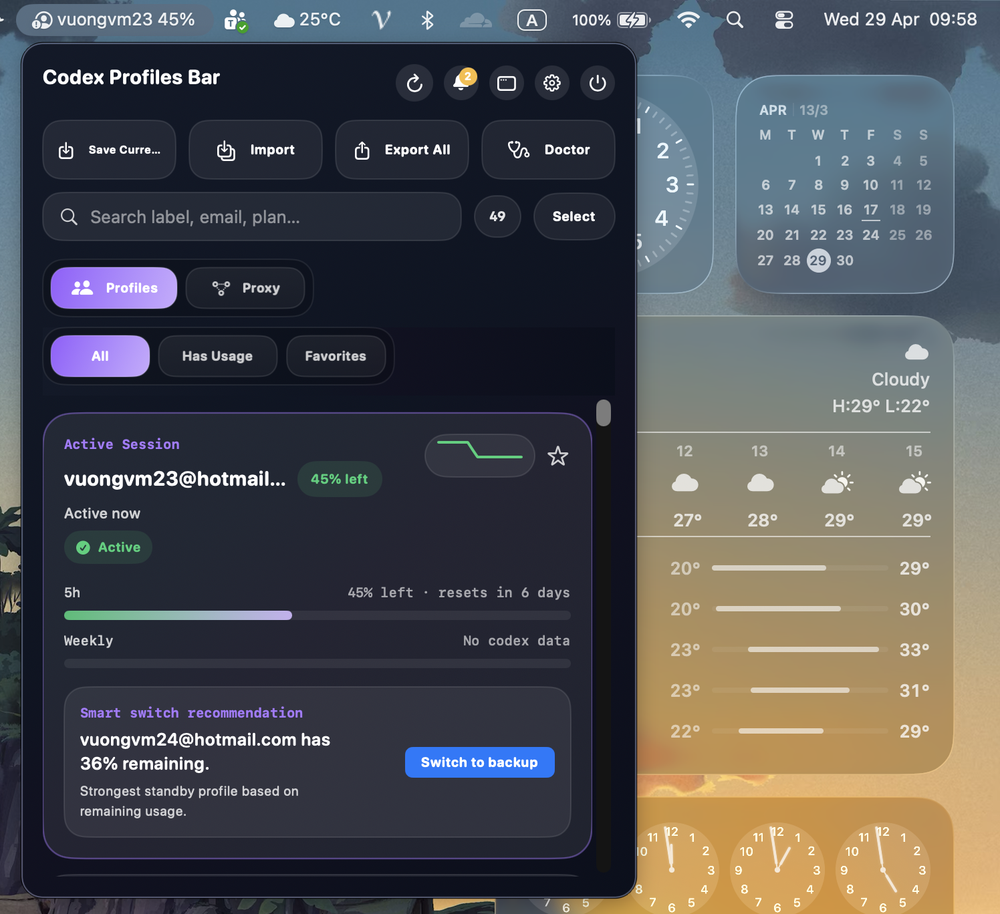

# Codex Profiles Bar

<p align="center">
  Native macOS menu bar app for managing multiple Codex sessions directly from your status bar.
</p>

<p align="center">
  Save the current session, switch accounts, inspect usage, preview imports, review alerts, route Codex through a local proxy, and package everything as a clean macOS app.
</p>

<p align="center">
  
</p>

<p align="center">
  
</p>

## Overview

Codex Profiles Bar is a standalone macOS app that works directly with the same `~/.codex` storage used by Codex, with built-in proxy routing so you can switch accounts without restarting the tool.

It keeps profile management in the menu bar so you can:

- see all saved profiles and the current active session at a glance
- switch between sessions without dropping back to the terminal, and without restarting Codex when proxy routing is enabled
- inspect remaining usage, low-usage trends, and aggregate usage from the status bar UI
- search, filter, favorite, and review saved profiles in a detached panel window
- save the current session, rename labels, clear labels, delete profiles, and repair local storage
- preview imported bundles before writing anything into `~/.codex`, then export portable JSON bundles
- receive low-usage alerts, review them in a notification inbox, and optionally auto-switch before a profile is exhausted
- run a local model proxy that follows the active profile, updates `model_provider`, and avoids Codex restarts when you switch accounts

No separate profile-management CLI is required.

## What's New

- Added a dedicated Proxy tab with a local loopback provider for Codex and an OpenAI-compatible `/v1` endpoint for manual clients.
- Expanded the settings flow so you can tune proxy port, upstream base URL, context window, and auto-compact limits without editing `~/.codex/config.toml` by hand.
- Added safer import preview and a notification inbox for low-usage alerts, auto-switch events, and follow-up actions.

## Highlights

| Feature | What it does |
| --- | --- |
| Menu bar workflow | Fast access from the macOS status bar |
| Built-in profile engine | Reads and writes profile data directly in `~/.codex` |
| Active session detection | Keeps the current session pinned and easy to identify |
| Usage inspection | Shows remaining usage, sparkline history, aggregate stats, and refreshes automatically |
| Search and filters | Filter profiles by usage or favorites and search by label, email, or plan |
| Session management | Save, switch, label, clear, delete, preview imports, import, and export |
| Alerts and auto-switch | Notify on low usage or reset windows, keep a notification inbox, and auto-switch to the best fallback profile |
| Model proxy | Optional loopback custom provider for Codex plus an OpenAI-compatible `/v1` endpoint, runtime tuning, and restart-free account switching |
| Detached panel and themes | Open a larger panel window with system, light, or dark appearance |
| Doctor tools | Run storage checks and apply safe repairs |
| Launch at login | Start automatically after login for packaged installs |
| Packaging helpers | Build a standalone `.app` bundle and `.dmg` installer |

## Requirements

- macOS 14 or newer
- Swift 6 / Xcode 16 toolchain
- Codex CLI installed and signed in at least once
- Local Codex auth available in `~/.codex/auth.json`

## Setup

Before using the app, make sure Codex itself is ready:

```bash
codex login
```

Codex Profiles Bar reads and writes the same local storage used by Codex, so it expects:

- `~/.codex/auth.json` to exist

## Run Locally

```bash
git clone https://github.com/MinhVuong1997/codex-profiles-bar.git CodexProfilesBar
cd CodexProfilesBar
swift run
```

You can also open `Package.swift` in Xcode and run the app there.

## How It Works

The app manages profiles directly in your local Codex home:

- current auth: `~/.codex/auth.json`
- saved profiles: `~/.codex/profiles/*.json`
- profile metadata index: `~/.codex/profiles/profiles.json`

It uses the same storage layout as Codex itself, so switching and saving profiles stays local to your machine.

### Model Proxy

The Proxy tab and Settings view include an optional local proxy bound to `127.0.0.1`. By default it exposes:

```text
Codex model provider base_url: http://127.0.0.1:20128/v1
OpenAI-compatible /v1: http://127.0.0.1:20128/v1
```

When the proxy is enabled, Codex Profiles Bar updates `~/.codex/config.toml` to point `model_provider` at a local Responses API endpoint. You can adjust the proxy port, upstream base URL, context window, and auto-compact token limit from the app. Reopen Codex once after enabling the proxy or changing routing so new chats pick up the local provider. After that, switching accounts does not require another Codex restart because the proxy rereads the active saved profile on each proxied request and keeps the active profile visible from the proxy dashboard.

If you do not use the proxy, switching accounts still updates the local Codex session directly, so you need to reopen or restart Codex after each account switch for new chats to use the new session.

### Proxy Setup

To enable restart-free account switching with the built-in proxy:

1. Open Codex Profiles Bar.
2. Go to the `Proxy` tab.
3. Turn on `Run local proxy`.
4. Keep the default port `20128` unless you already use it for another service.
5. Review `Upstream base URL`, then click `Save` if you changed the port or upstream.
6. Confirm `Codex routing` changes to `Custom model_provider points at the local proxy`.
7. Click `Reopen Codex` once if the app shows `Codex reopen required`.
8. Start a new Codex chat. From this point on, switching accounts in the app will not require another restart while proxy routing stays enabled.

You can also copy the local endpoint from the app with `Copy endpoint` if you want to use the same proxy from another OpenAI-compatible client.

## Package For Installation

Build the `.app` bundle:

```bash
./scripts/build-app.sh
```

Build the `.dmg` installer:

```bash
./scripts/build-dmg.sh
```

Build artifacts are written to:

```text
dist/
```

After copying `CodexProfilesBar.app` into `/Applications`, you can enable launch at login from Settings.

## Project Structure

```text
Sources/CodexProfilesBar   SwiftUI app source
Assets/                    App icon and README assets
scripts/                   Build and packaging helpers
dist/                      Generated .app and .dmg output
```

## Development Notes

- The app is built with SwiftUI and shipped as a Swift Package executable.
- The built-in engine handles profile storage, session switching, import/export, usage fetching, and doctor checks inside the app.
- App icons are generated from `scripts/generate-icon.py`.
- Packaging output is created in `dist/`.

## License

MIT. See [LICENSE](LICENSE).
