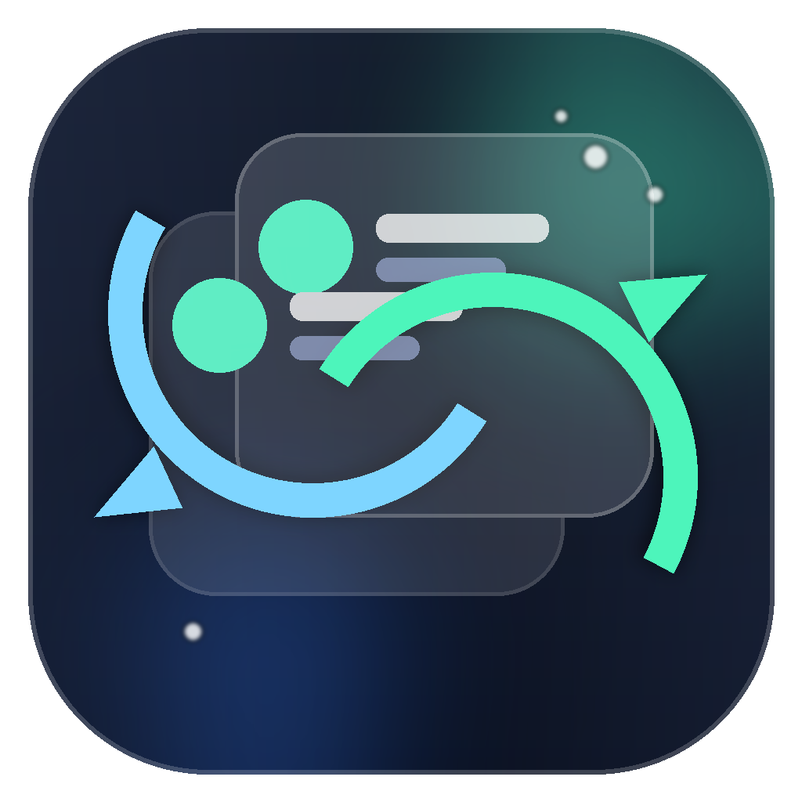
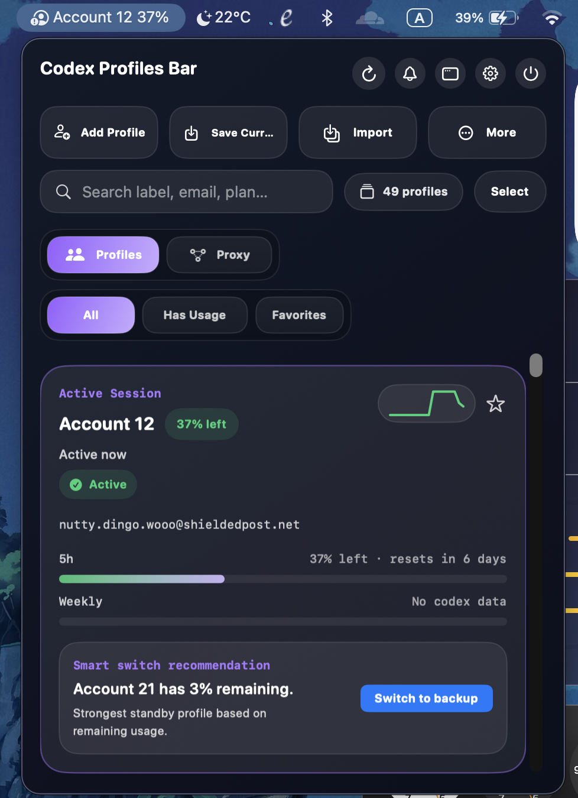

# Codex Profiles Bar

<p align="center">
  
</p>

<p align="center">
  A native macOS menu bar utility for managing multiple Codex accounts from one place.
</p>

<p align="center">
  
</p>

## Overview

Codex Profiles Bar puts your Codex account profiles in the macOS menu bar. It lets you manage multiple signed-in accounts, see their usage status, and switch between them without manually replacing files in `~/.codex`.

The app works with Codex's existing local files, so your profiles stay on your Mac. When the local proxy is enabled, you can switch accounts without restarting Codex or the app.

The app is a standalone SwiftUI executable package with no external Swift package dependencies.

## Features

| Area | Details |
| --- | --- |
| Manage accounts | Save the active Codex session, switch accounts, rename labels, favorite profiles, delete profiles, and repair local storage. |
| Monitor usage | View remaining usage, usage meters, aggregate status, warnings, and refresh state for each profile. |
| Find profiles quickly | Search, filter by usage or favorites, reorder profiles, use keyboard navigation, and open a detached panel. |
| Import and export | Preview profile bundles before writing them to `~/.codex`, then import or export portable JSON files. |
| Notifications and automation | Receive low-usage alerts and optionally switch to a healthier saved profile when usage is depleted. |
| Optional proxy | Switch accounts without restarting Codex or the app through an OpenAI-compatible local `/v1` endpoint. |
| Customization | Choose the theme, compact layout, refresh interval, notification settings, accent color, and launch-at-login behavior. |

## Requirements

- macOS 14 or newer
- Swift 6.2 toolchain, or Xcode with Swift 6.2 support
- Codex CLI installed and available as `codex`
- Python 3 with Pillow installed when regenerating icons or running packaging scripts

## Get Started

1. Make sure Codex CLI is installed and available as `codex`.
2. Build and launch Codex Profiles Bar:

```bash
git clone https://github.com/MinhVuong1997/codex-profiles-bar.git CodexProfilesBar
cd CodexProfilesBar
swift run
```

3. Use **Add Profile** to sign in and save another Codex account, or use **Save Current** to store the session that is already active.
4. Select a saved profile to switch accounts. With the proxy enabled, the switch takes effect without restarting Codex or the app. Without the proxy, reopen Codex before starting a new chat with the switched account.

You can also open `Package.swift` in Xcode and run the `CodexProfilesBar` executable target.

## How Profiles Are Stored

The app reads and writes the same local Codex home used by the CLI:

```text
~/.codex/auth.json
~/.codex/profiles/*.json
~/.codex/profiles/profiles.json
```

Profile credentials remain in the local Codex directory. Imported profiles are previewed before anything is written to disk.

## Model Proxy

The Proxy tab can start a local proxy bound to `127.0.0.1`. It lets you switch between saved Codex accounts without restarting Codex or Codex Profiles Bar. By default it exposes:

```text
http://127.0.0.1:20263/v1
```

When enabled, the app routes Codex by overwriting `openai_base_url` in `~/.codex/config.toml`. Reopen Codex once after enabling or changing the proxy base URL so new chats pick up the selected route. After that, switching profiles in Codex Profiles Bar can reuse the same running proxy because the proxy reads the active saved profile for each proxied request.

Without the proxy, switching profiles still updates the local Codex session, but you should reopen or restart Codex before starting a new chat with the newly selected account.

## Build

Build the executable:

```bash
swift build
```

Build a release executable:

```bash
swift build -c release
```

## Package

Build a local macOS app bundle:

```bash
./scripts/build-app.sh
```

Build a DMG installer:

```bash
./scripts/build-dmg.sh
```

The scripts generate or refresh the icon assets, build the release binary, create `dist/CodexProfilesBar.app`, sign it with an ad-hoc signature, and optionally create `dist/CodexProfilesBar.dmg`.

You can override bundle metadata when building:

```bash
APP_IDENTIFIER=com.example.codexprofilesbar APP_VERSION=2.0.4 ./scripts/build-app.sh
```

## Project Structure

```text
Sources/CodexProfilesBar/   SwiftUI app source
Assets/                     App icon and README assets
scripts/                    Build, DMG, and icon helpers
dist/                       Generated app and installer output
Package.swift               Swift package manifest
```

## Development Notes

- `Package.swift` defines one executable target: `CodexProfilesBar`.
- The native engine handles local profile storage, auth switching, import/export, usage refresh, doctor checks, and proxy configuration.
- `scripts/generate-icon.py` requires Pillow and writes `Assets/AppIcon-1024.png` plus `Assets/AppIcon.icns`.
- `dist/` is generated output and should not be treated as source.

## License

MIT. See [LICENSE](LICENSE).
